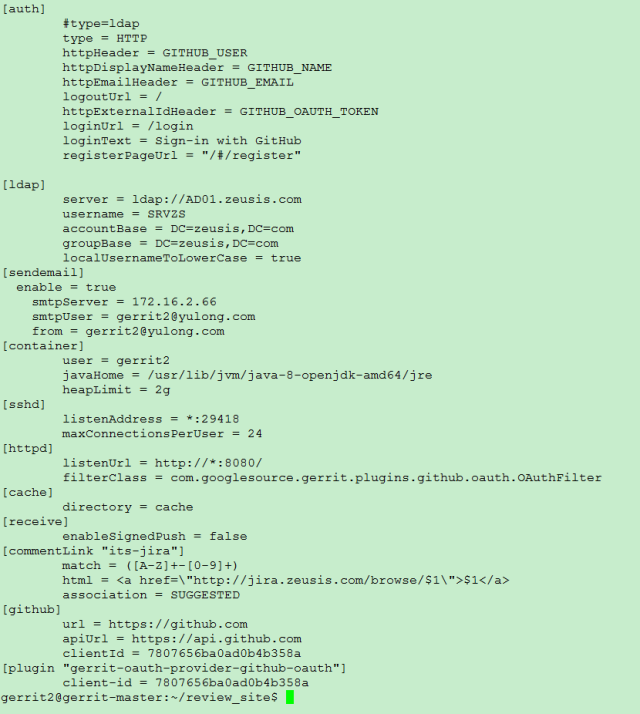
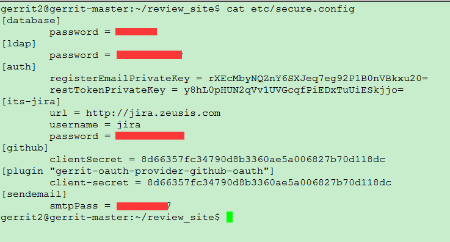

 
* http://julien.danjou.info/blog/2013/rant-about-github-pull-request-workflow-implementation
In reality there are already OpenSource projects that have started using the two tools together:

* OpenStack (https://wiki.openstack.org/wiki/GerritJenkinsGithub)
* MediaWiki (http://www.mediawiki.org/wiki/Gerrit)

The reason for using GitHub and Gerrit together are: a) GitHub is widely recognised and accessible by lots of world-wide sites. b) Using a public GitHub repo allows to “off-load” a lot of git pull traffic. c) Pull-request allows novice users to start getting involved. d) Gerrit code-review define the quality gates for avoiding “noise” of unstructured contributions.

#Why a Gerrit plugin ?
When using GitHub and Gerrit together, the “master of truth” has to be Gerrit: this is because it is the place where more control in terms of security and workflow can be defined.

A Gerrit plugin can help controlling the GitHub replica and importing the pull requests as Gerrit changes.

#Integration points

##Authentication. (DONE - Change-Id: I7291a90014e51316af3cb07fd03785c1ef33acd0)

Users can login to Gerrit using the same username and credentials in GitHub. Gerrit login points to GitHub for generating the OAuth token to be used for the code-review authenticated session.

The initial Gerrit registration page can be customised to import GitHub SSH Keys directly into Gerrit.

##Push-Pull replication. (DONE - Change-Id: I596b2e80b4d9519668a1ab289d6c950139d6a922)

Existing GitHub repositories are automatically replicated to Gerrit for the purpose of performing code-review and pushing back changes once approved. Additionally to the standard Gerrit push replication, supports as well the ability to pull branches from remote GitHub repositories.

##Pull-request to Change. (DONE - Change-Id: d669e351a03798cc2ec966d028458f083c232564)

Hooks into the GitHub pull-request mechanism to automatically create a Change in Gerrit submitted for review.

#How to build this plugin

Gerrit 2.10 build
GitHub plugin is designed to work with Gerrit 2.10 (currently in development). In order to build the GitHub plugin you need to have a working Gerrit 2.10 build in place.

See https://gerrit-review.googlesource.com/Documentation/dev-buck.html for a reference on how to build Gerrit 2.10 (master branch) using BUCK.

#GitHub API
In order to access GitHub API, we have used the lucamilanesio fork of Kohsuke API layer hosted on GitHub at https://github.com/lucamilanesio/github-api.

You need to clone and build the GitHub API as pre-requisite for building the GitHub plugin for Gerrit.

Example: git clone https://github.com/lucamilanesio/github-api.git cd github-api mvn install -DskipTests=true

#singleusergroup plugin
You need to clone, build and install the singleusergroup plugin for Gerrit (see https://gerrit-review.googlesource.com/#/admin/projects/plugins/singleusergroup).

This plugin is needed to allow Gerrit to use individual users as Groups for being used in Gerrit ACLs. As of Gerrit 2.10 singleuserplugin is a core plugin and included in Gerrit tree (if it was cloned recursively).

Example: cd gerrit buck build plugins/singleusergroup cp buck-out/gen/plugins/singleusergroup/singleusergroup.jar $GERRIT_SITE/plugins/.

#Building GitHub integration for Gerrit
Just clone the Git repository (see https://gerrit-review.googlesource.com/#/admin/projects/plugins/github) and do a mvn install from the root directory. This will create two JARs under github-oauth/target and github-plugin/target: the oauth is a JAR library to be copied to $GERRIT_SITE/lib whilst the plugin JAR has to be installed as usual under $GERRIT_SITE/plugins.

Example: git clone https://gerrit.googlesource.com/plugins/github cd github mvn install cp github-oauth/target/github-oauth-.jar $GERRIT_SITE/lib cp github-plugin/target/github-plugin-.jar $GERRIT_SITE/plugins
 
插件可以到这个地址下载：
https://gerrit-ci.gerritforge.com/

# Register Gerrit as a Github OAuth application
* login to Github
* open the URL: https://github.com/settings/applications/new
* Application name: Gerrit
* Homepage URL: https://review.my-domain.org
* Authorization callback URL: https://review.my-domain.org/oauth

Note: Client ID & Client Secret are generated that used in the next step..
 上一部中需要这样登录github注册一个。

#Running Gerrit init to configure GitHub OAuth
```
java -jar buck-out/gen/gerrit.war $gerrit_site

User Authentication

Authentication methodi []: HTTP

Ger username from custom HTTP header [Y/n]? Y

Username HTTP header []: GITHUB_USER

SSO logout URL : /oauth/reset

GitHub Integration

GitHub URL: [https://github.com]:

Use GitHub for Gerrit login? [Y/n] Y

ClientId []:

ClientSecret []:

```

#Receiving Pull Request events to automatically import
* Create a github user account which automatic import operation uses.
* Register the account to your gerrit site by logging into Gerrit with the account.
* Create webhook on your github repository.
The payload URL should be something like http://your-gerrit-host.example/plugins/github-plugin-version/webhook.
It is recommended to specify some webhook secret.
* Edit etc/gerrit.config and etc/secure.config files in your $gerrit_site.
Add the github user account name as webhookUser entry in github section of etc/gerrit.config
* Add the webhook secret as webhookSecret entry in github section of etc/secure.config.


#Contributing to the GitHub plugin
The GitHub plugin uses the lombok library, which provides a set of annotations to reduce the amount of boilerplate code that has to be written.

To build the plugin in Eclipse, the Lombok Eclipse integration must be installed.

Download lombok.jar from http://projectlombok.org/ and install:

java -jar lombok.jar
Follow the instructions to select your Eclipse installation if the installer cannot detect it automatically.

After the installation, Eclipse must be restarted and compilation errors should disappear.





