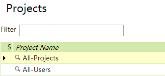
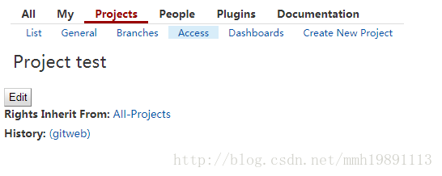
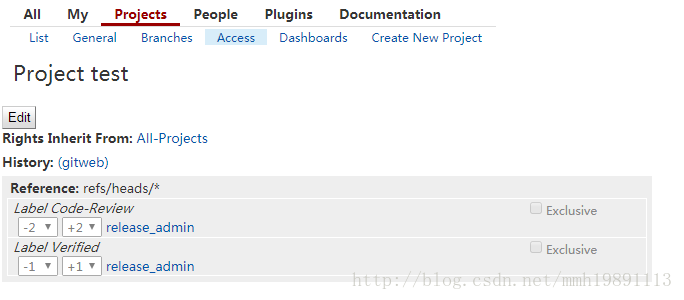
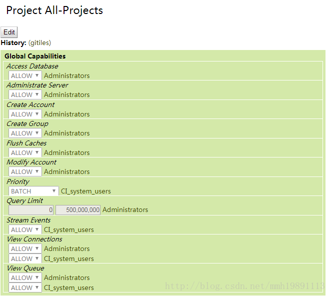
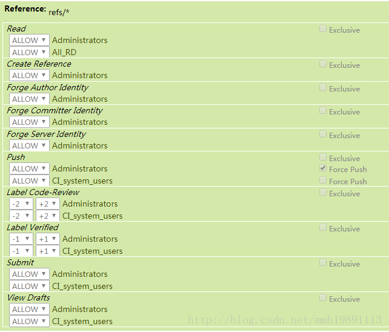
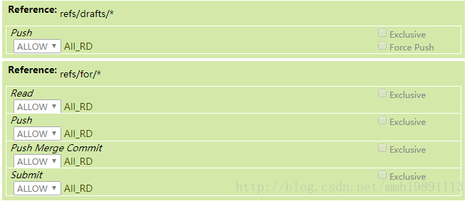
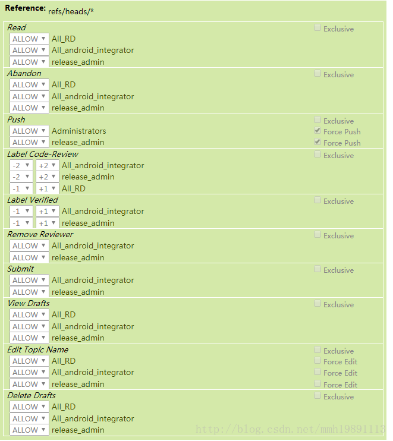

#Android下的配置管理之道之gerrit权限管理


Gerrit Code Review - Access Controls

在Gerrit中访问控制是基于组的。每个用户帐户都是一个或多个组的成员，并授予这些组的访问权和特权。访问权限不能授予单个用户。

gerrit中的组

 - System Groups 系统组
```
    Anonymous Users 匿名用户组.所有的用户都自动属于这个组的。没有登陆的用户会属于这个组。
这个组最好只设置read读的权限，其他权限不要设置！
例如，一般的会给repo这个仓库设置个允许匿名访问。


    Change Owner 某个提交的拥有者的一个群组。一般不使用。


    Project Owners  项目，也就是某个仓库的拥有者的一个群组。一般的不使用。


    Registered Users  所有的注册用户的组，这个会用到一些。
一般的可以给这个组设置个Code-Review -1..+1的权限。
```

 - Predefined Groups预定义的群组
 

```
Administrators  管理员群组，权限最大的。
Non-Interactive Users 非交互的群组，一般jenkins帐号，自动化的一些个帐号放到这个组里面。
```

 - Account Groups  自己新建的群组。
 - LDAP Groups   这个是绑定了ldap服务器才会使用到的群组。这个也算是一种Account Groups 。


----------
在安装好gerrit。我们会看到2个默认的仓库，或者叫project。
第一个，也是非常重要的一个是：All Projects


这个是管理权限的仓库，gerrit是把权限的相关设置存放到一个git仓库下的，这个仓库就是叫All-projects。
当然自己也可以定义新建权限的仓库。
这个All-projects是所有权限的父仓库。其他的权限仓库都会继承这个。


例如上面图片中的test仓库，他的权限就是继承自All-Projects的。

当然每个仓库也会有自己独立的权限配置。


```
图片中的这一段就是这个仓库自己设置的权限。
Reference:	
refs/heads/*
Label Code-Review Exclusive
   release_admin
Label Verified Exclusive
   release_admin
```
这个仓库首先有个权限是继承All-Projects，然后自己又有一段自己的权限配置。


----------
下面我们来看看gerrit中一些特殊的references参考。Special and magic references。
一般的这个ref参考在git中也是有使用的，估计是gerrit参考git来的。
在git中这个ref参考只有2个，一个是给tag用的，一个是给branch用的。

```
refs/heads/*
refs/tags/*
```
一般说来refs/* ，就是这个refs命名空间下面的所有的都是有效的references参考。
在gerrit中又增加了其他的特殊的references参考。

```
refs/changes/*
这个命名空间下面存放的是上传的提交。最常用的。
一般的会按照这样的格式来存放：'refs/changes/'<last two digits of change number>/ <change number>/ <patch set number>。
例如：refs/changes/68/16068/2，这个可以在也没上面找到的。
git fetch ssh://10.0.12.62:29418/test refs/changes/68/16068/2 && git cherry-pick FETCH_HEAD


refs/meta/config
这个是存放project配置的。常用。

refs/meta/dashboards/*
这个是存放dashboards的。这个一般常用。

refs/notes/review
这个是存放review的信息的。一般也不用。
```

```
refs/for/<branch ref>
上传patch，提交patch会先push到这个命名空间分支下面，然后进行review。一切ok了在合入到真正的分支下面。
review和合入操作都是在界面上面进行操作的。
这个refs/for/<branch ref>对应的分支是refs/heads/<branch ref>。
如果不进行走读是可以直接push到refs/heads/<branch ref>下面的，当然这样是需要权限的。一般是不给开发
这个push权限的。一般的开发都是需要进行走读的，都必须push到refs/for/<branch ref>下面的分支上。


refs/publish/*
这一个是refs/for/<branch ref>的一个替代，一般在界面上直接新建一个提交的时候会是publish状态

refs/drafts/*
草稿形式的。Push to refs/drafts/* 和 push to refs/for/*是类似的。草稿顾名思义就是还为完成的提交
，不完整的提交等。这个还是比较推荐开发使用的。


```


----------
下面贴出来马哥的配置权限的。
在这个总的all-projects里面配置的都是管理员相关的权限设置。





然后，all-android继承all-projects，all-android仓库是马哥自己创建的一个权限仓库。
这个里面就设置了refs/for/*  下面的权限，一般的就是所有的人都能push就行。

然后，这个是all-android仓库里面设置的refs/heads/*下面的权限，这个比较重要。＋１＋２,submit等权限都是这个下面设置的。



最后一个是all-bsp仓库，这个仓库继承all-android，all-bsp仓库也是是马哥自己创建的一个权限仓库。这个里面设置了＋１＋２,submit等权限。


总的说来，对于android项目的几百个仓库，有的仓库是属于bsp组的。有的属于modem组的，等等。
这样就按照模块一一设置权限。一般的主要就是设置这个submit的权限。
