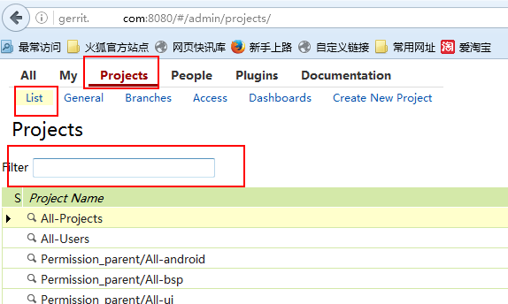
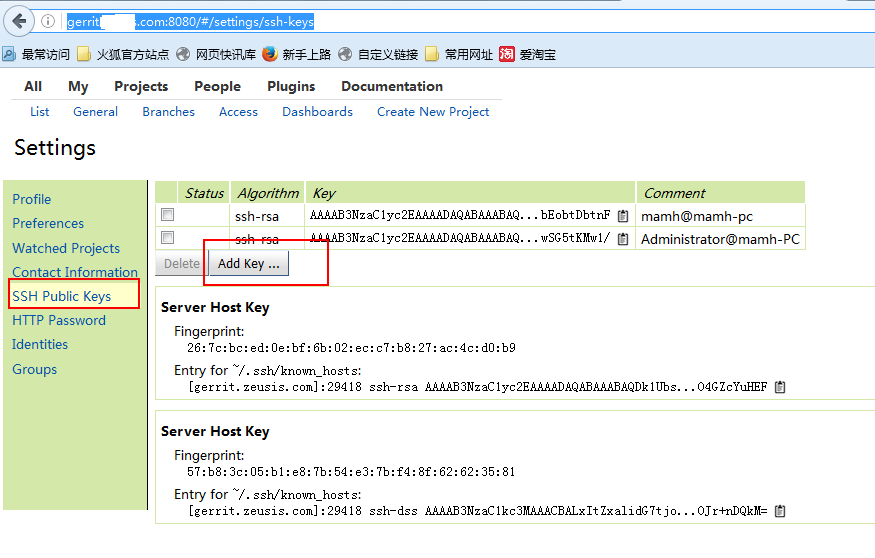
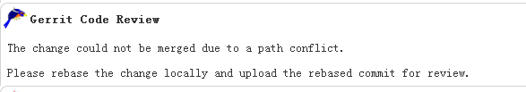

这里是一些常见问题的总结，可能关于git，repo，gerrit，ubuntu等

* FAQ : fatal: 'xxxxx/bbbbbbbbbb/platform/manifest.git': not a Gerrit project

80%是因为没有权限，可以尝试访问http://gerrit.xxx.com:8080/#/admin/projects/ 搜索一下有没有这个
project， 在下面的filter框里面输入project的名称，可以只输入最后的一个单词，会过滤出来的。



如果project的list里面看不到任何东西，表明没有gerrit的权限。

当然还有20%是因为project的名字打错了，同样去上面的地址搜下，找到正确的project名字即可


* FAQ :Permission denied (publickey).

本地的ssh key和服务器上不匹配或者本地的key有问题，可以重新把key在gerrit上贴一遍
cat ~/.ssh/id_rsa.pub 命令的输出结果
贴到http://gerrit.xxxx.com:8080/#/settings/ssh-keys 里面




* FAQ :error: xxxxxxxxx: prior sync failed; rebase still in progress

sync的时候会自动做rebase动作，如果上次rebase异常终止再次执行就会失败，找到失败的project，执行命

令git rebase --abort可强制终止


* FAQ :error:xxxxxxxxx: contains uncommitted changes

本地有未提交的修改，可以通过git status命令查看，如果确认不需要的话，可以通过以下命令清楚 git reset HEAD --hard;git clean -fd

* FAQ :error:xxxxxxxxx: branch xxxx  is published (but not merged) and is now 3 commits behind

本地提交上传gerrit后尚未完成review合入，此时其他人的修改提前合入导致提交顺序错误，尝试执行命令解决 git rebase 分支名

* FAQ :remote: ERROR: In commit d573c63af66a98d18f24a00226e823b089ae7725  remote: ERROR: committer email address y  remote: ERROR: does not match your user account.

本地提交用户信息与gerrit服务器上注册的邮件地址不一致，执行如下环境配置命令后重新commit, upload即可
git config --global user.name "xxxxx" ---换成你自己的名字
git config --global user.email "xxxxx@xxxxx.com" —换成你自己的邮件地址

也可以参考这个文档 http://gerrit.xxxxx.com:8080/Documentation/error-invalid-author.html


* FAQ :查看git status时没有颜色提示
git config --global color.ui auto


* FAQ :error: not Signed-off-by author/committer/uploader
commit log中没有按规范添加signed-off-by信息，本地回退commit后，在commit命令中添加 -s 参数重新提交即可

* FAQ :error: no branches ready for upload
只有与远程分支建立追踪关系的本地分支才能识别，通俗的说请使用 【repo start 分支名 --all】 命令建立本地分支

* FAQ :error: .repo/repo/: contains uncommitted changes

在工程根目录下复制执行下边的命令后重新sync即可

cd .repo/repo;git checkout .;cd -;rm -rf .repo/repo


* FAQ :当前目录repo sync完了啥也没有怎么办
很大可能是由于曾经在当前目录的父目录中执行过repo init，repo的sync逻辑是先递归向上找.repo目录，
只要找到了就去那里面sync

解决方法：把父目录中的.repo移走或者干掉再来

 
* FAQ :在工作区里面commit完了后还没有upload，这时突然发现看见最后的commit就恶心，要让它消失咋办？

git reset --hard HEAD^ (最后一个改动的代码都不见了,慎用)
git reset --soft HEAD^ (最后一个提交的代码又回到了未add状态，可以接着修改了)

* FAQ :：依次改动了A,B,C，D四个commit，现在想把小B的改动抛弃了咋办？

git rebase -i   [B的commit id]^

在出来的文件里删掉小B占的那行，也就是第一行

这时再git log已经看不到小B了。

更多的git rebase的技巧可以百度，谷歌吧。这个都属于git的高级技巧了。


* FAQ :git log出来的不直观，我想详细看看到底我们干了啥？

sudo apt-get install gitk

执行  gitk &

装个图形看log的工具gitk，所见即所得


或者使用tig 命令，sudo apt-get install tig


* FAQ：error: insufficient permission for adding an object to repository database

同步代码时切换过用户名导致的权限问题，需要变更出错的文件的owner和group

sudo chown -R username:username *

* FAQ：更新代码的时候我做过merge，那个merge commit没有change id，导致后边的commit在repo upload的时候出错，怎么破？
答：在有问题的库里运行如下命令，可以将merge commit和后面的commit合并为一个commit
```
git reset --soft 【merge commit之前的一个commit的id】

git add filename filename ......

git commit
```

现在就可以再次git push了


* FAQ：某个提交review不通过（或被abandone），并且有其他提交依赖于它的时候怎么办？

答：首先要养成良好习惯，本地提交要及时上传到服务器，不要攒多了一起提交。

假设review没有通过的提交为小B，本地同分支后续还有C,D。首先用17题的方法在本地修改代码，
而后git push。如果C和D之前已经提交到gerrit上了，现在可以看到在C和D的gerit页面上出现
了patchset2,并且C的依赖关系也发生了变化，不再依赖B了。

* FAQ 在gerrit上提交后出现如下冲突后如何处理？




回到ubuntu下面出现冲突的代码库下

>git rebase

git会提示出现冲突的文件，打开这个文件，搜">>>>>>>"找到出现冲突的具体代码的位置，然后解决冲突，存文件

>git add 冲突文件

>git rebase --continue

看下结果，如果没有更多的冲突，rebase完成，运行repo upload，否则继续修改新的冲突的文件–>git add—> git rebase

--continue。

git push 后gerrit 上将会出现如下信息，这时候就可以再次编译->请代码评审人继续评审->在gerrit上提交代码了


* FAQ:repo upload: missing Change-Id in commit message footer

通过git log查看发现没有添加change-id，按照系统提示安装hook，git commit --amend即可


* FAQ: change … closed

参考： http://gerrit.xxx.com:8080/Documentation/error-change-closed.html

错误原因：拥有相同change-id的change已经是merged或abandoned状态

在gerrit右上角的搜索框，输入change number检索change 37588

发现该提交已经被merged了，请检查是否本次提交仍然有必要


* FAQ: 本地repo版本比服务器上的repo版本低，会提示如下错误：
解决办法： 更新 ~/bin/repo为 repo ，同时删除工作区中的.repo/repo目录后，重新执行repo init 代码下载命令，

* FAQ:若遇到"warning：rename ‘HEAD’ is ambiguous"。
解决方法：

运行"git branch -a"查看下。

把HEAD分支重命名为localhead: “git branch -m head localhead”


* FAQ:Agent admitted failure to sign using the key. 下载代码错误
 
 解决方法：ssh-add


* FAQ:    Bad owner or permissions on xxx/.ssh/config
 
解决方法：.ssh/config文件权限不对，正常权限为600，本地执行chmod 600 ~/.ssh/config

标准权限示例：-rw------- 1 mamh mamh 369 Jul 16 18:03 .ssh/config


