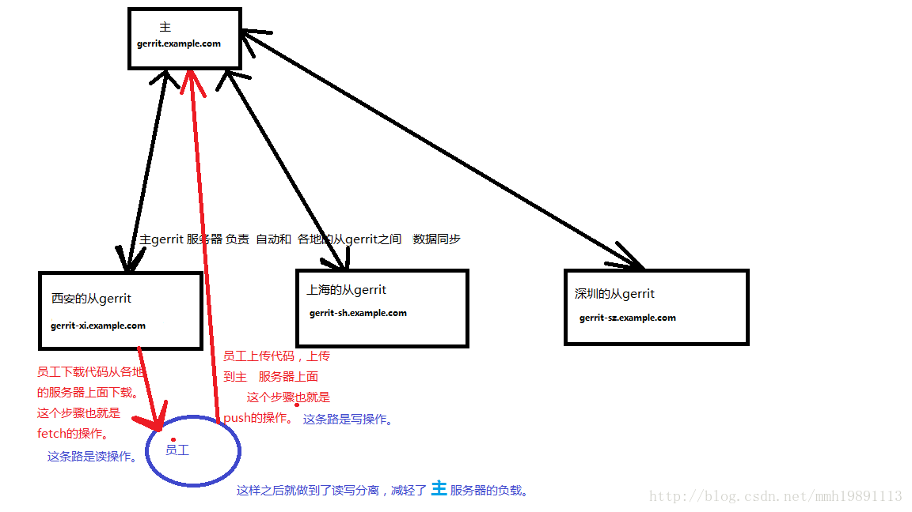

gerrit配置使用replication插件

最终实现的效果如下图所示



实现员工下带代码从一个从gerrit下载，上传代码到主gerrit上。

首先是主gerrit服务器上面要配置一下ssh相关的
```
gerrit2@gerrit-master:~$ cat -n .ssh/config 

# 这个是上海site的配置   
Host gerrit-sh.example.com
User gerrit2
Hostname 10.0.12.18
IdentityFile ~/.ssh/id_rsa
PreferredAuthentications publickey
StrictHostKeyChecking no
UserKnownHostsFile /dev/null
        
# 这个是西安site的配置   
Host gerrit-xi.example.com
User gerrit2
Hostname 192.168.38.175
IdentityFile ~/.ssh/id_rsa
PreferredAuthentications publickey
StrictHostKeyChecking no
UserKnownHostsFile /dev/null 

   
```


然后是需要配置replication.config 文件
```
replication.config 
[remote "gerrit-sh"]
    url  = gerrit2@gerrit-sh.example.com:/home/gerrit2/review_site/git/${name}.git
    projects = "^git/android/.*"
    projects = "^git/shared/.*"
    projects = "^git/aosp/.*"
    projects = "^Permission_parent/.*"
    projects = "All-Projects"
    projects = "All-Users"

    push = +refs/*:refs/*
    mirror = true

    replicatePermissions=true
    threads = 16
    replicationDelay = 5

[remote "gerrit-xi"]
    url  = gerrit2@gerrit-xi.example.com:/home/gerrit2/review_site/git/${name}.git
    projects = "^git/android/.*"
    projects = "^Permission_parent/.*"
    projects = "All-Projects"
    projects = "All-Users"

    push = +refs/heads/*:refs/heads/*
    push = +refs/users/*:refs/users/*
    push = +refs/meta/*:refs/meta/*

    mirror = true
    replicatePermissions=true
    threads = 8
    replicationDelay = 5

```
